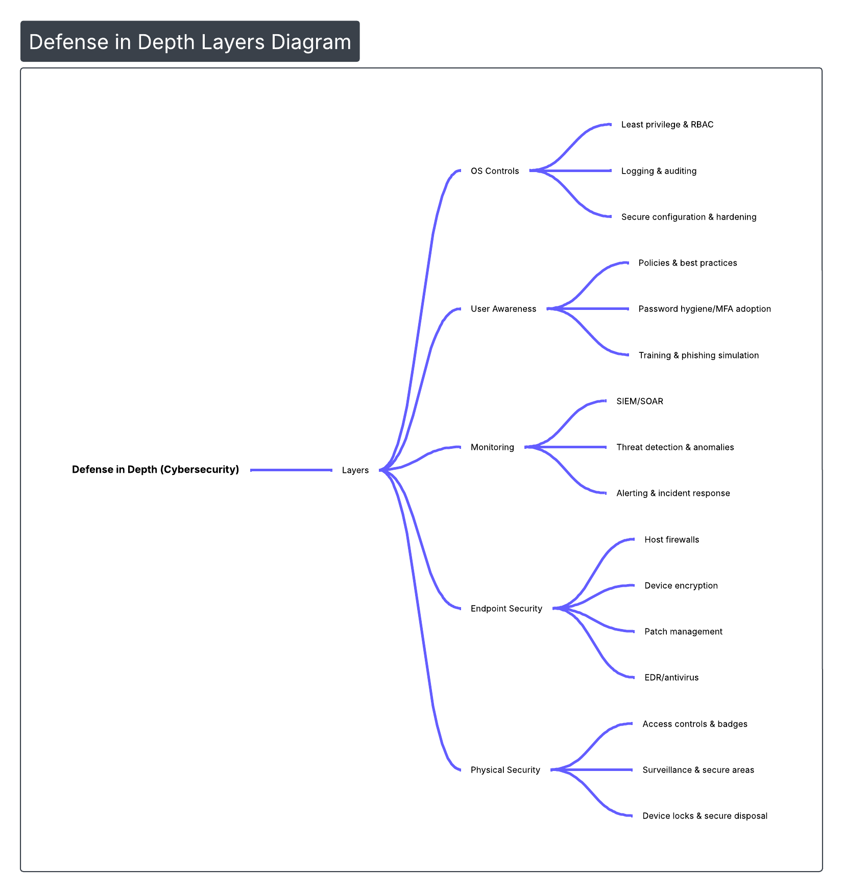

# arduino-hid-usb-security-assessment
Evaluación de riesgos de seguridad asociados a dispositivos USB que emulan HID utilizando un Arduino Leonardo. El proyecto analiza vectores de ataque básicos y propone medidas de mitigación aplicables a entornos organizacionales reales.


## Descripción general

Este repositorio documenta una **evaluación de riesgos de seguridad** asociada al uso de dispositivos USB que emulan **Human Interface Devices (HID)**, utilizando **Arduino Leonardo** como plataforma de pruebas. El proyecto demuestra, en un **entorno controlado y con fines educativos**, cómo un hardware open source y de bajo presupuesto puede comportarse de forma similar a herramientas como *USB Rubber Ducky* y qué **contramedidas prácticas** pueden aplicarse.

El enfoque es **técnico, ético y preventivo**. No se publican scripts ofensivos completos.

### Diagrama — Visión general del proyecto


---

## Overview

This repository documents a **security risk assessment** related to USB devices that emulate **Human Interface Devices (HID)**, using **Arduino Leonardo** as a testing platform. In a **controlled and educational environment**, the project shows how low-budget and open-source hardware can replicate the behavior of tools such as *USB Rubber Ducky*, and which **practical countermeasures** can mitigate these threats.

The approach is **technical, ethical, and preventive**. Full offensive scripts are not published.

### Diagram — Project overview


---

## Objetivos del proyecto

* Evaluar el impacto de dispositivos HID maliciosos conectados vía USB.
* Analizar vectores de ataque básicos ejecutados sin interacción del usuario.
* Identificar riesgos reales para organizaciones y usuarios finales.
* Proponer contramedidas técnicas y organizativas alineadas con buenas prácticas.

---

## Project objectives

* Assess the impact of malicious USB HID devices.
* Analyze basic attack vectors executed without user interaction.
* Identify real risks for organizations and end users.
* Propose technical and organizational countermeasures aligned with best practices.

---

## Alcance

* Entorno de pruebas **controlado**.
* Sistemas Windows con configuraciones comunes.
* Emulación HID mediante Arduino Leonardo.
* Evaluación de **cuatro vectores de ataque** a nivel demostrativo.

### Fuera de alcance

* Explotación avanzada o persistente.
* Escalamiento de privilegios.
* Pruebas en entornos productivos.

---

## Scope

* **Controlled** testing environment.
* Windows systems with common configurations.
* HID emulation using Arduino Leonardo.
* Evaluation of **four demonstrative attack vectors**.

### Out of scope

* Advanced or persistent exploitation.
* Privilege escalation.
* Production environment testing.

---

## Metodología

1. Análisis teórico del riesgo USB/HID.
2. Configuración del laboratorio.
3. Emulación de dispositivo HID.
4. Ejecución controlada de vectores de ataque.
5. Análisis de resultados y riesgos.
6. Definición de contramedidas.

### Diagrama — Flujo metodológico


---

## Methodology

1. Theoretical analysis of USB/HID risk.
2. Lab environment setup.
3. HID device emulation.
4. Controlled execution of attack vectors.
5. Results and risk analysis.
6. Countermeasure definition.

### Diagram — Methodology flow


---

## Vectores de ataque evaluados 

* Deshabilitación del antivirus.
* Deshabilitación del firewall.
* Extracción de credenciales Wi‑Fi almacenadas.
* Exfiltración de información por correo electrónico.

> **Nota:** Se documentan flujos e impacto, no scripts completos.

---

## Evaluated attack vectors 

* Antivirus disabling.
* Firewall disabling.
* Extraction of stored Wi‑Fi credentials.
* Information exfiltration via email.

> **Note:** Flows and impact are documented; full scripts are not published.

---

## Resultados clave

* Ejecución en segundos tras la conexión USB.
* Sin interacción del usuario.
* Reconocimiento como teclado legítimo por el sistema.
* Impacto potencial **alto** sobre la confidencialidad e integridad.

---

## Key results

* Execution within seconds after USB connection.
* No user interaction required.
* Recognized as a legitimate keyboard by the OS.
* **High** potential impact on confidentiality and integrity.

### Diagram — CIA triad impact


---

## Contramedidas propuestas

* Políticas de bloqueo de sesión y control de puestos.
* Concienciación del usuario sobre seguridad física.
* Endpoints con controles reforzados.
* Restricción y monitoreo de dispositivos USB.
* Controles alineados con ISO/IEC 27002.

---

## Proposed countermeasures

* Session lock and workstation control policies.
* User awareness on physical security.
* Hardened endpoint controls.
* USB device restriction and monitoring.
* Controls aligned with ISO/IEC 27002.

### Diagram — Defense layers



---

## Consideraciones legales y éticas

Proyecto desarrollado con fines **educativos y de concienciación**, respetando la legislación vigente y principios de hacking ético. El uso indebido de estas técnicas puede constituir un delito.

---

## Legal and ethical considerations

Developed for **educational and awareness purposes**, respecting applicable laws and ethical hacking principles. Misuse of these techniques may be illegal.

---

## Estructura del repositorio / Repository structure

```
arduino-hid-security-assessment/
│
├── README.md
├── docs/
│   ├── 01_introduccion.md
│   ├── 02_marco_teorico.md
│   ├── 03_metodologia.md
│   ├── 04_vectores_ataque.md
│   ├── 05_analisis_riesgos.md
│   ├── 06_contramedidas.md
│   └── 07_conclusiones.md
│
├── diagrams/
├── legal-ethics/
└── references/
```

---

## Autor / Author

**Gabriel Parrales Gutiérrez**
Cybersecurity | Risk Analysis | Security Awareness

---

## Licencia / License

Uso educativo. No autorizado para actividades ilícitas. / Educational use. Not authorized for illegal activities.
